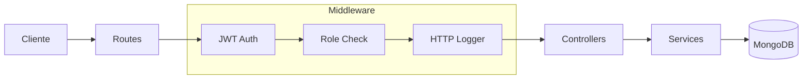
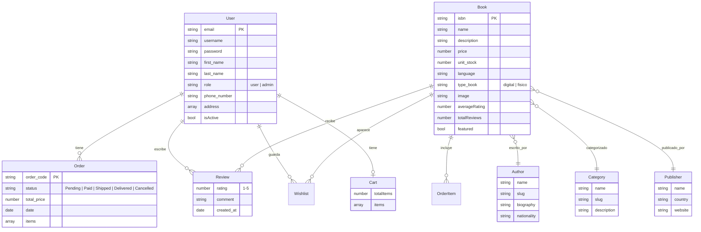

# AkiraBooks

## Librería Online · E-commerce Full-Stack

Proyecto de tienda de libros con catálogo, carrito, pagos y panel admin

  
  Empecemos <carbon:arrow-right class="inline" />
  

---
layout: two-cols
---

# ¿Qué es AkiraBooks?

Aplicación web de e-commerce para la venta de libros

::right::

**Para clientes:**
- Catálogo con búsqueda y filtros
- Carrito de compras
- Checkout con Stripe
- Historial de pedidos
- Perfil de usuario

**Para administradores:**
- Panel con métricas y gráficas
- Gestión de pedidos
- Gestión de usuarios
- Control de stock

---
layout: center
---

# Stack Tecnológico

### Backend
<v-clicks>

- **Node.js** + **Express 5**
- **MongoDB** + **Mongoose**
- **JWT** (access + refresh tokens)
- **Stripe** (pagos)
- **Swagger** (documentación API)
- **Pino** (logging)

</v-clicks>

### Frontend
<v-clicks>

- **React 19** + **Vite 7**
- **Tailwind CSS 4** + **shadcn/ui**
- **React Router** v7
- **Recharts** (gráficas admin)
- **Context API** (Auth + Cart)
- **Docker** + **Nginx**

</v-clicks>

---

# Arquitectura Backend

  
Routes

  
Definen endpoints y middleware

  
Controllers

  
Manejan request/response HTTP

  
Services

  
Lógica de negocio y BD

---

# Base de Datos

---

# Features del Frontend

  
📚

  
Catálogo

  
Búsqueda, filtros, vista grid/lista

  
🛒

  
Carrito

  
Persistente en localStorage

  
💳

  
Pagos Stripe

  
Checkout seguro integrado

  
🔐

  
Auth JWT

  
Login/register con refresh tokens

  
📊

  
Panel Admin

  
Métricas, pedidos, usuarios

  
🐳

  
Docker

  
Multi-stage build + Nginx

---
layout: center
class: text-center
---

# Demo en Vivo

🚀

Veamos la aplicación funcionando

  http://localhost:8080

---
layout: center
class: text-center
---

# Gracias

  ¿Preguntas?

